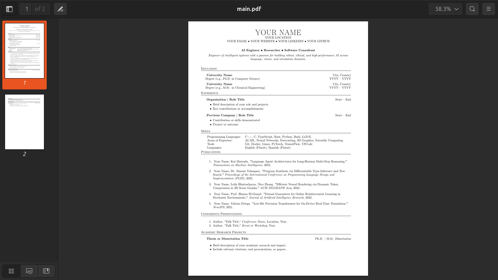
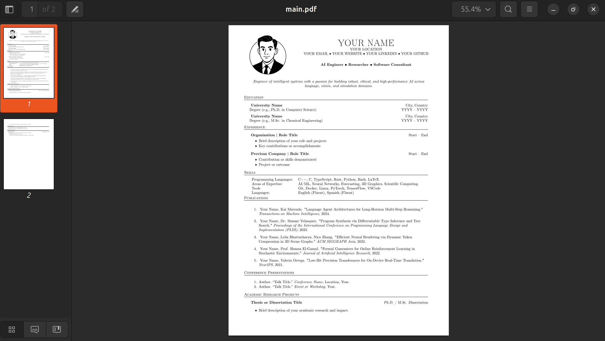

# AI CV Template (LaTeX)

A clean, modular LaTeX CV template for researchers, engineers, developers, and academics working in AI, software, and computer science.  
Based on the resume structure of [Andrew R. Garcia, Ph.D.](https://andrewgarcia.vercel.app/), this template is built for clarity, elegance, and customization — with all sections organized into modular files.

---

## ✨ Features

- Modular section files (`/sections`) for easy editing
- Custom macros for headers and layout consistency
- Supports experience, education, skills, awards, certs, and publications
- Picture and no-picture variants available
- Ideal for technical, academic, or industry CVs

---

## Preview

### **Standard CV (no photo)**  
> Branch: [`main`](https://github.com/andrewrgarcia/ai-cv-template/tree/main)



---

### **CV with Photo**  
> Branch: [`picture-cv`](https://github.com/andrewrgarcia/ai-cv-template/tree/picture-cv)



> The `picture-cv` version includes a professional, racially-neutral cartoon-style photo placeholder, in a vintage yet confident tone. You can replace it with your own illustrated or formal photo.

---

## 📁 Directory Structure

```
ai-cv-template/
├── main.tex                # Main LaTeX file
├── README.md               # This file
├── assets/
│   ├── preview.png         # Standard CV screenshot
│   └── picture-preview.png # Photo CV screenshot
└── sections/               # All modular content files
    ├── education.tex
    ├── experience.tex
    ├── skills.tex
    ├── publications.tex
    ├── conference.tex
    ├── academic.tex
    ├── certs.tex
    ├── projects.tex
```

---

## 🚀 Quick Start

### 1. Clone this repo

```bash
git clone https://github.com/andrewrgarcia/ai-cv-template.git
cd ai-cv-template
```

To use the photo version:

```bash
git checkout picture-cv
```

---

### 2. Customize

Replace placeholder content in:

```latex
\contact{{{ YOUR NAME }}}{{{ YOUR LOCATION }}}{{{ EMAIL • WEBSITE • LINKEDIN }}}
```

Edit content inside each section file under `/sections`.

In the `picture-cv` branch, update the image file:
```latex
\includegraphics[width=0.12\textwidth]{assets/your-photo.png}
```

---

### 3. Compile

With `pdflatex`:

```bash
pdflatex main.tex
```

Or automatically with `latexmk`:

```bash
latexmk -pdf main.tex
```

✅ Compatible with **TeX Live**, **Overleaf**, and local builds.

---

## 📝 License

MIT License. Free for personal and commercial use.

---

Created by [Andrew R. Garcia](https://andrewgarcia.vercel.app/)  
Made open-source to help others build standout CVs in AI, engineering, and science.
